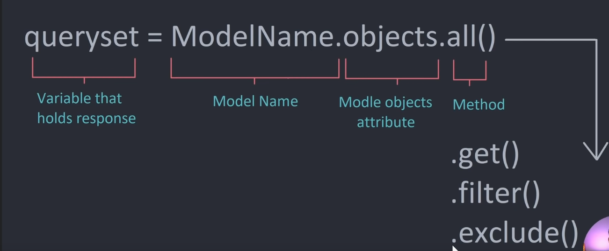

# Intruducion a Django

## Instalcion del entorno vitual

## Instalacion de Django

```python
pip install django
```

## Creacion de un Nuevo Proyecto

- Creacion del proyecto en la misma carpeta
```python
django-admin startproject mysite .
```
- Creacion del proyecto con una carpeta nueva
```python
django-admin startproject mysite
```
## Creacion del Proyecto Base

- Ejecucion del proyecto Base
```python
python manage.py startapp base
```

## Ejecucion del Proyecto Creado

- Ejecucion del proyecto
```python
python manage.py runserver
```
## Ejecucion de la Base de Datos

- Vamos a migrar y con estos valores crear la base de datos
```python
python manage.py migrate
```

- Una ves creado nuestra base de datos en el archivo "models.py" vamos a migrarlos a la aplicacion
```python
python manage.py makemigrations
```

> Si queremos iniciar una base de datos con Django, ejecutamos "python manage.py migrate", ya hemos creado la instancia para la base de datos, si nosotros creamos la base de datos y la queremos subir ejecutamos "python manage.py makemigrations" y por ultimo esta base de datos creada, la subimos con el siguiente comando "python manage.py migrate".

 
## Creacion del Usuario para administrar el panel 

- creacion del usuario o nuevo usuario
```python
python manage.py createsuperuser
```


## Configuracion Final de la Base de Datos Creada

> Una que ya hemos creado nuestro usuario para ingresar al panel de administracion, como tambien a ver creado nuestra base de datos y a ver lo migrado, tenemos que agregarlo en el archivo "admin.py", agregar la base de datos creada en el archivo "models.py".<>

```python
from .models import Room
admin.site.register(Room)
```

## Extraer los valores de la Base de Datos

- Con este linea de comandos se van importar los valores de nuestra base a datos a nustro HOME
- Este tipo de importaciones se realizara en el archivo "views.py"

```python
from .models import Room
def home(requst):
    rooms = Room.objects.all()
    context = {'rooms':rooms}
    return render(requst, "base/home.html",context )
```



## Unir dos tablas en Django

> Vamos a unir dos tablas la principal es la tabla "Room", la tabla que depende de la tabla principal sera "Message", si se elimina la tabla Room, tambien se eliminara la informacion asociada la tabla Message

```python
class Room(models.Model):
    host = models.ForeignKey(User, on_delete=models.SET_NULL, null=True)
    topic = models.ForeignKey(Topic, on_delete=models.SET_NULL, null=True)
    name = models.CharField(max_length=200)
    description = models.TextField(null=True, blank=True)
    updated = models.DateTimeField(auto_now=True)
    created = models.DateTimeField(auto_now_add=True)
    def __str__(self):
        return self.name

## Union de tablas

class Message(models.Model):

    user = models.ForeignKey(User, on_delete=models.CASCADE)
    room = models.ForeignKey(Room, on_delete=models.CASCADE)
    body = models.TextField()
    updated = models.DateTimeField(auto_now=True)
    created = models.DateTimeField(auto_now_add=True)

    def __str__(self):
        return self.body[0:50]
    
```

## Implementacion de las plantillas 

> Cuando creamos la interfas grafica, tenemos que crear los archivos ".html", donde se aloja la estructura base, pero tambien hay que hacer las conexiones a Django
> Lo primero que haces es crear el archivo ".html" en "base/templates/base" , una vez creado el archivo, has que instanciarlo en el archivo "views.py" y por ultimo tenemos que indexarle una URL asi que lo cremos en el archivo "urls.py"

```html
<!-- Estamos reando la plantilla del archivo .html--!>



<h1>Hola Home</h1>
<div>
  <div>
    
    <div>
      <h5>
        <span>@{{room.host.username}}</span>
        {{room.id}} -- <a href=""> {{room.name}}</a>
        <small>{{room.topic.name}}</small>
        <hr />
      </h5>
    </div>
    
  </div>
</div>



```

```python
# le definimos una URl al archivo ".html" en el archivo ".views.py"
from django.shortcuts import render
from .models import Room
def home(requst):
    rooms = Room.objects.all()
    context = {'rooms':rooms}
    return render(requst, "base/home.html",context )
```

```python
# indexamos esa URL en el archivo "urls.py"
from django.urls import path
from . import views
urlpatterns = [
    path('', views.home, name="home"),
    path('room/<str:pk>/', views.room, name="room")
]
```

## Implementacion CRUD, funcionalidad en sitios Web

- Crear
- Leer
- Actualizar
- Eliminar


## Significado de Cada Archivo

- Archivo "wsgi.py" -> Puerta de enlace a la interzar del servidor web
- Archivo "urls.py" -> Encargado de hacer el enrutamiento de las URL(Nos indica las diferentes Paginas)
- Archivo "asgi.py" -> Encargado de la sincronizacion de archivos (?)
- Archivo "settings.py" -> Encargado de la configuracion de nuestro proyecto


